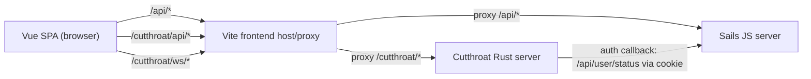

# Cutthroat (3P) Feature and System Architecture

## Summary
Cutthroat adds a 3-player Cuttle mode powered by a new Rust service while keeping the existing JS/Sails stack as the source of authentication and the full runtime for existing 2-player modes.

Design goals:
- Add 3P mode without destabilizing 2P flows.
- Keep one browser origin and one frontend app.
- Reuse existing JS session auth.
- Allow JS-only development when Rust is unavailable.

## What This Feature Adds
- New game mode: **Cutthroat (3 players)**.
- New Rust workspace:
  - `cuttle-rust/crates/cutthroat_engine`: rules/state machine/tokenlog.
  - `cuttle-rust/crates/cutthroat_server`: Axum HTTP + WebSocket runtime.
- New frontend routes/views/stores for 3P lobby + game UX.
- Capability gating so Cutthroat UI only appears when Rust is available.
- Docker/dev wiring for JS + Rust side-by-side.

## High-Level Architecture

## Service Boundaries

### JS/Sails owns
- User accounts, login/session cookies, existing app APIs.
- Legacy 2P game flows (unchanged by this feature).

### Rust owns
- Cutthroat lobby lifecycle and in-game state.
- Cutthroat rule enforcement and legal actions.
- Cutthroat game/lobby WebSocket fanout.

## JS ↔ Rust Interaction (Critical Path)

### 1. Browser-to-service routing
Frontend always talks to same-origin paths:
- `/api/*` -> JS/Sails
- `/cutthroat/api/*` -> Rust
- `/cutthroat/ws/*` -> Rust WebSocket

This is done with Vite proxy config so the browser does not need multi-origin setup.

### 2. Authentication bridge (Rust reuses JS session)
Rust does not implement a separate auth system. Instead:
1. Rust reads incoming `Cookie` header.
2. Rust calls JS endpoint `GET {JS_INTERNAL_BASE_URL}/api/user/status` with that cookie.
3. JS returns auth status + user identity.
4. Rust caches that result briefly (30s TTL) by session key.

Result: one session model across both stacks, no duplicate login state.

### 3. Real-time state updates
Rust server exposes:
- `GET /cutthroat/ws/lobbies` for lobby list updates.
- `GET /cutthroat/ws/games/:id` for game updates.

Frontend Cutthroat store:
- Subscribes to lobby/game WS.
- Reconnects automatically with bounded backoff.
- Updates local Pinia state from `state` messages.

### 4. Action submission and optimistic safety
When a player acts:
- Frontend sends action over WS when available; HTTP fallback exists.
- Payload includes `expected_version`.
- Rust rejects stale/conflicting actions if server version changed.

This protects game consistency under network delay or concurrent events.

### 5. Capability/fallback behavior
Frontend probes Rust health (`/cutthroat/api/v1/health`) with timeout + retry backoff.
- If available: show Cutthroat create/list/routing.
- If unavailable: hide Cutthroat entry points and redirect `/cutthroat/*` routes to `/` with user-visible message.
- 2P remains fully functional.

## Rust Runtime Model
- In-memory lobby/game state for active Cutthroat games; Postgres is still required for normal server startup/history persistence (unless built with `e2e-seed`).
- Broadcast channels for:
  - game state updates
  - lobby list updates
  - scrap straighten UX sync events
- Engine provides legal actions and public views per seat.
- Server returns both:
  - player-specific view
  - spectator-oriented view

## Frontend Integration
- New routes:
  - `/cutthroat`
  - `/cutthroat/lobby/:gameId`
  - `/cutthroat/game/:gameId`
- Route guard checks auth + Cutthroat capability.
- New `cutthroat` Pinia store encapsulates Rust API/WS contract.
- Home page create flow now supports mode selection (2P / 3P / AI), with 3P shown only when available.

## Deployment and Local Dev

### Dev
- JS-only: run existing dev commands; Cutthroat UI auto-disables.
- With Rust: run `cargo run -p cutthroat_server`, then standard JS dev server/client.

### Docker
- Multi-stage build compiles JS and Rust binary.
- Single app container runs:
  - Rust server (optional via `CUTTLE_ENABLE_CUTTHROAT`)
  - Sails server
  - Vite client/proxy

Key env vars:
- `CUTTLE_ENABLE_CUTTHROAT`
- `RUST_BIND_ADDR`
- `JS_INTERNAL_BASE_URL`
- `CUTTLE_RUST_URL`

## Testing and Validation Added
- Rust CI job (`cargo test` on `cuttle-rust` workspace).
- Engine tests for rules/tokenlog/replay scenarios.
- Frontend unit tests for capability and Cutthroat store behavior.
- E2E smoke coverage for Cutthroat lobby/game flows and WS behaviors.

## Why This Architecture
- Minimizes blast radius: 3P is isolated from stable 2P backend paths.
- Keeps auth unified: Rust delegates identity to JS session APIs.
- Preserves UX continuity: same frontend app, same origin, route-level fallback.
- Enables incremental rollout: Cutthroat can be turned on/off independently.
